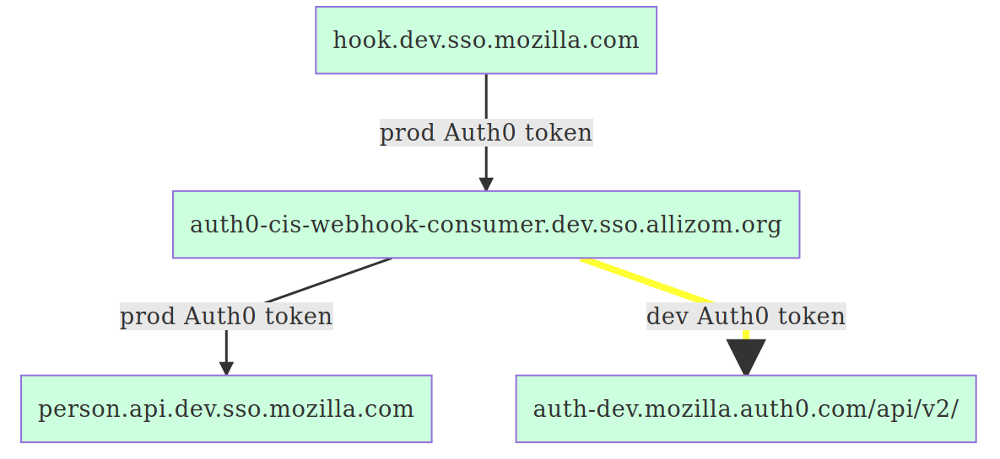

# auth0-cis-webhook-consumer

An API Gateway and AWS Lambda webhook consumer that consumes 
[webhook POSTs from CIS](https://github.com/mozilla-iam/cis/blob/master/docs/Hooks.md)
and in response
* Verifies the authorization token in the header is valid
* Fetches the user profile for the user ID passed
* Cleans the group names
* Publishes those group changes to the Auth0 management API to update the user's
  profile in Auth0

The design of this (Makefile with deploy.sh which uses AWS CLI to package
and deploy the tool) differs from other CIS projects (serverless command line
tool with serverless.yml to deploy). In the long run I hope to change this to
fit with the style of other CIS components but for the moment, this is faster
for me to get this up and running.

# Architecture

* `auth0-cis-webhook-consumer.test.sso.allizom.org.` DNS record in `mozilla-iam`
  AWS account is an alias to AWS API Gateway
* API Gateway proxies all request to AWS Lambda function
* Lambda function calls appropriate Python function based on the URL path in the
  request

# Deploy

## Provision Auth0 Clients

This is a one time step.

In order to grant the Auth0 CIS Webhook Consumer rights to 

* query the CIS PersonAPI
* send updates to the Auth0 Management API

A set of Auth0 applications/clients needs to be provisioned. The three 
deployments of the Auth0 CIS Webhook Consumer (production, development, testing)
require various Auth0 clients on various Auth0 tenants

* production deployment of `auth0-cis-webhook-consumer`
  * `auth.mozilla.auth0.com` tenant access to `api.sso.mozilla.com`
  * `auth.mozilla.auth0.com` tenant access to `auth.mozilla.auth0.com/api/v2/`
* testing deployment of `auth0-cis-webhook-consumer`
  * `auth.mozilla.auth0.com` tenant access to `api.sso.mozilla.com`
  * `auth-dev.mozilla.auth0.com` tenant access to `auth-dev.mozilla.auth0.com/api/v2/`
* development deployment of `auth0-cis-webhook-consumer`
  * `auth.mozilla.auth0.com` tenant access to `api.sso.mozilla.com`
  * `auth-dev.mozilla.auth0.com` access to `auth-dev.mozilla.auth0.com/api/v2/`

To achieve this 3 Auth0 clients need to be provisioned

1. Prod PersonAPI
   * Tenant : `auth.mozilla.auth0.com`
   * Name : `PersonAPI - auth0-cis-webhook-publisher`
   * APIs
     * API name : `api.sso.mozilla.com`
       * Note : *Don't select `person-api.sso.mozilla.com`*
       * Scopes
          * `classification:public`
          * `display:all`
     * API name : `api.dev.sso.allizom.org`
       * Note : *Don't select `person-api.sso.mozilla.com`*
       * Scopes
          * `classification:public`
          * `display:all`
       * API name : `api.test.sso.allizom.org`
         * Note : *Don't select `person-api.sso.mozilla.com`*
         * Scopes
            * `classification:public`
            * `display:all`
2. Prod Management API
   * Tenant : `auth.mozilla.auth0.com`
   * Name : `Management API - auth0-cis-webhook-publisher`
   * API name : `Auth0 Management API`
   * Scopes
      * `update:users`
      * `update:users_app_metadata`
2. Dev Management API
   * Tenant : `auth-dev.mozilla.auth0.com`
   * Name : `Management API - auth0-cis-webhook-publisher`
   * API name : `Auth0 Management API`
   * Scopes
      * `update:users`
      * `update:users_app_metadata`

Here's how to provision each of these 3 applications

1. Browse to Auth0 applications either in [`auth.mozilla.auth0.com`](https://manage.mozilla.auth0.com/dashboard/pi/auth/applications)
   or [`auth-dev.mozilla.auth0.com`](https://manage-dev.mozilla.auth0.com/dashboard/pi/auth/applications)
   depending on the `Tenant` shown above.
1. Click '+ Create Application`
1. Enter the `Name` value shown above
1. In `Choose an application type` select `Machine to Machine applications`
1. In `Authorize Machine to Machine integrations` in the `Select an API...` 
   dropdown select the `API name` shown above
1. Check the `Scopes` shown above
1. Click `Authorize`
1. Now that the Auth0 Application has been provisioned and API grants have been
   created, go to the `Settings` tab for the new application
1. In the `Description` field enter `Owner: John Doe` where `John Doe` is an
   appropriate contact. Also add a link to this GitHub repo to the description.
1. At the bottom of the settings screen, click `Show Advanced Settings`
1. Click the `Grant Types` tab
1. Ensure that the `Client Credentials` grant is already checked

Repeat this for all 3 clients

You can later find or modify these scopes by going to the application in Auth0,
then going to the `APIs` tab. Go to the `https://api.sso.mozilla.com/` or 
`Auth0 Management API` API which should show as `Authoirze` and click the down
arrow (`⌄`) on the right side of the row to the right of the switch that 
authorizes or deauthorizes the API. This will expand the scopes so you can see
what's set and modify it.

## Record Client IDs and Secrets

Once the Auth0 application/clients are provisioned, store the resulting 
`client_id` and `client_secret` values.

The `client_id` is public data and the values should be stored in the 
[`Makefile`](Makefile) in the following variables
* `PROD_PERSONAPI_CLIENT_ID`
* `PROD_MANAGEMENT_API_CLIENT_ID`
* `DEV_MANAGEMENT_API_CLIENT_ID`

The `client_secret` should be stored in AWS System Manager Parameter Store as a
`SecureString` with the following parameter names
* The Auth0 prod PersonAPI Client Secret in
  * `/iam/cis/production/auth0_cis_webhook_consumer/personapi_client_secret`
  * `/iam/cis/development/auth0_cis_webhook_consumer/personapi_client_secret`
  * `/iam/cis/testing/auth0_cis_webhook_consumer/personapi_client_secret`
* The Auth0 prod Management API Client Secret in
  * `/iam/cis/production/auth0_cis_webhook_consumer/management_api_client_secret`
* The Auth0 dev Management API Client Secret in
* `/iam/cis/development/auth0_cis_webhook_consumer/management_api_client_secret`
* `/iam/cis/testing/auth0_cis_webhook_consumer/management_api_client_secret`

With a description of `OAuth client secret for https://github.com/mozilla-iam/auth0-cis-webhook-consumer`

## Deploy in dev

Run this in the `mozilla-iam` AWS account
```
AWS_PROFILE=iam-admin make deploy-dev
```

### What's the AWS iam-admin profile?

In your `~/.aws/config`, ensure the following exists:

```
[profile iam-admin]
sso_session = mozilla
sso_account_id = 320464205386
sso_role_name = AdministratorAccess
sso_region = us-west-2
region = us-west-2
sso_start_url = https://mozilla-aws.awsapps.com/start#
```

# Testing

## Unit Testing
To run unit tests enter the command
```
pytest test
```

### Using Moto to Mock AWS Services
AWS Secrets are mocked using the [moto](https://docs.getmoto.org/en/latest/index.html) library.

Moto requires fake AWS credentials be established before the test. All tests should be annotated with @mock_aws.


## Query

```
curl -d '{"foo": "bar"}' -i \
  https://auth0-cis-webhook-consumer.test.sso.allizom.org/test
curl -d '{"foo": "bar"}' -i \
  https://auth0-cis-webhook-consumer.test.sso.allizom.org/error
curl -d '{"foo": "bar"}' -i \
  https://auth0-cis-webhook-consumer.test.sso.allizom.org/404
```

### Getting a Bearer Token to Impersonate CIS Webhook Publisher

* Copy paste the `curl` command to provision a token from the API in dev or 
  prod. To fetch the curl command for provisioning a token use one of these 
  links.
  * [`hook.dev.sso.allizom.org` client](https://manage.mozilla.auth0.com/dashboard/pi/auth/apis/5c80d6ddaf6977386c57d06f/test)
  * [`hook.test.sso.allizom.org` client](https://manage.mozilla.auth0.com/dashboard/pi/auth/apis/5c9c0950c32ba0449dd355c4/test)
  * [`hook.sso.mozilla.com` client](https://manage.mozilla.auth0.com/dashboard/pi/auth/apis/5c9c0965c32ba0449dd355e4/test)
* Take the `access_token` value and use it in the `${TOKEN}` section of this

```
curl -H  "Authorization: Bearer ${TOKEN}" \
  -d '{"operation": "update", "id": "ad|Mozilla-LDAP|dinomcvouch"}' -i \
  https://auth0-cis-webhook-consumer.test.sso.allizom.org/post
```

# Diagrams

## Production


## Development




## Testing


# Problems with the dev environment

These problems would need to be fixed to be able to use this in dev
* The URL https://auth.allizom.org/.well-known/openid-configuration doesn't
  correctly proxy the request on to https://dev.mozilla-dev.auth0.com/.well-known/openid-configuration
  * https://github.com/mozilla-iam/cis/issues/239#issuecomment-633789313
* https://person.api.dev.sso.allizom.org appears to return 500 errors
* I wonder if this API client in auth0-dev is used for anything : https://manage-dev.mozilla.auth0.com/dashboard/pi/auth-dev/apis/5ade471295cf6c01e80c3cdc/settings
